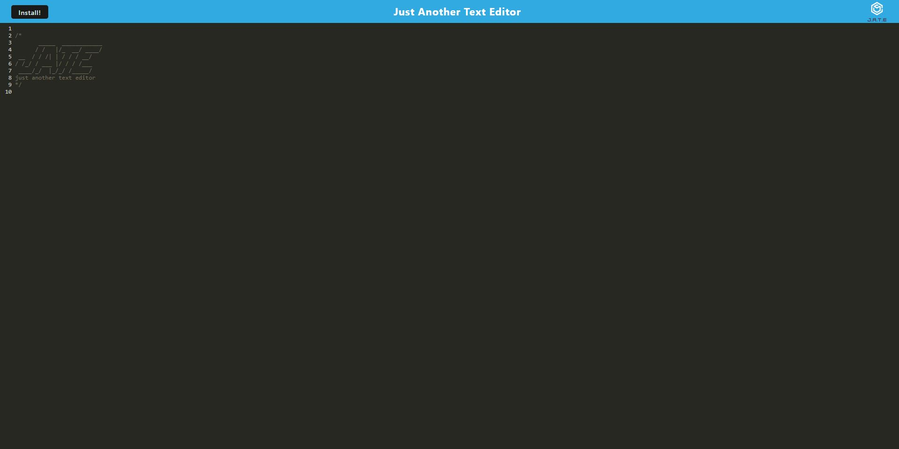
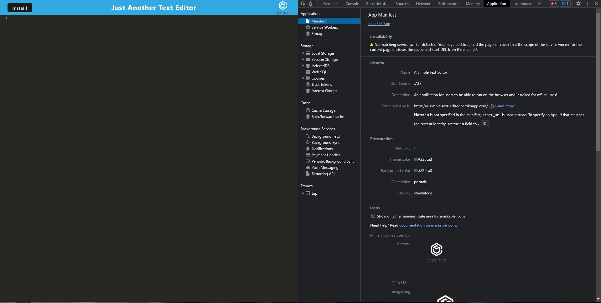
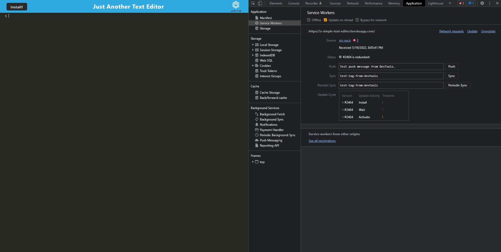
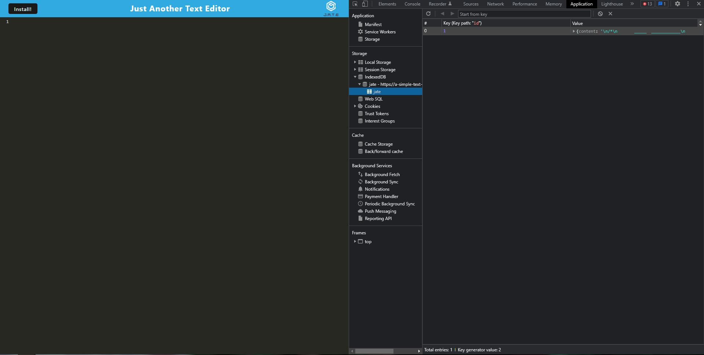

# A Simple Text Editor

## Description
The objective of this project is to create a text editor for users to save their notes with and/or without having an internet connection. The application is expected to have users to be able to download the text editor so that users can retrieve their notes for later.

## Table of Contents
      
- [Installation](#installation)
- [Usage](#usage)
- [Questions](#questions)
      
## Installation
Used express, build, and Heroku.

## Usage
Application screenshot

Application's manifest.json

Registered service worker

Application's indexedDB storage

[Heroku Link](https://a-simple-text-editor.herokuapp.com/)

## Questions
Have any Questions? Contact me: [carolynngo11@yahoo.com](mailto:carolynngo11@yahoo.com)